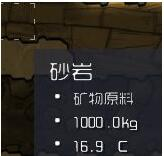
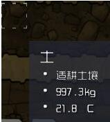
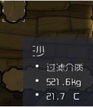
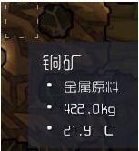

# 选人初期 

----------
- 只要关心压力反应就行。 
- 呕吐可以出污水，污水会污染环境。
- 破坏性的会砸设备，修理需要大量的时间。我只说一次都选呕吐的
- 特征和期待不用管，人多的话优势互补，反正复制人很好打印。

#材料用处
----------
主要分为固体、液体 气体(废话就只有这几种状态)

##固体

-  矿物材料，基本用于大量建筑，但是个人不建议过量开采，因为没有用啊。采集一箱子就够了
- 
-  适耕土壤，两个用途，种地和食物，。后期也特别多，吃土需要消耗水，注意节制。
-   
- 过滤介质，可以净化污氧变为纯净氧，或者净化污水变成干净水
- 
-  金属原料，用于电力等建筑制作，初期一定要弄几块铜，才能做能源和研究，一般真空区铜矿密集
- 
-  污水，污氧生物莫波制造出来的产物，但是神一般的复制人能在这种环境畅快地呼吸。

##有机类

- 　粘液藻类和肥料。粘液可以转化成藻类,藻类用于造氧，肥料基本没用。
##可用的矿石
分为氧石棉和煤炭

　　**氧石棉** 自己可以造氧气，消耗自己，娱乐大众，后期基本是不存在的。

　　**煤炭** 用于火力发电了。
##生物
- 吸收污氧释放干净氧，拉出粘液
- 
-  吸收周围气体，产出污氧，真空环境凭空召唤术制氧，而且没有气压限制。
- 

　

[http://www.anqu.com/oxygen/gonglue/290159.shtml](http://www.anqu.com/oxygen/gonglue/290159.shtml "网络选摘抄")